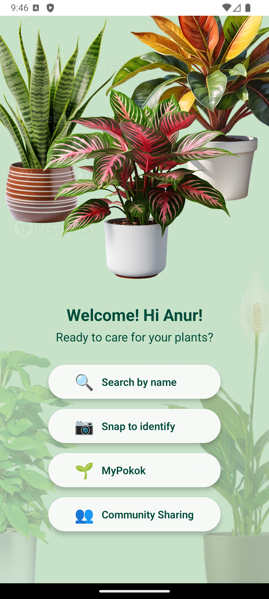
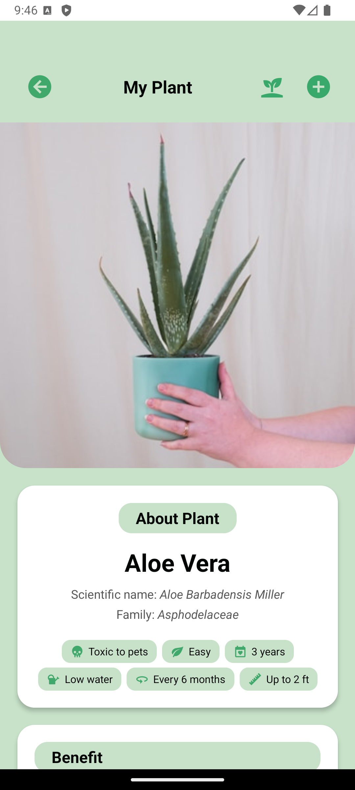
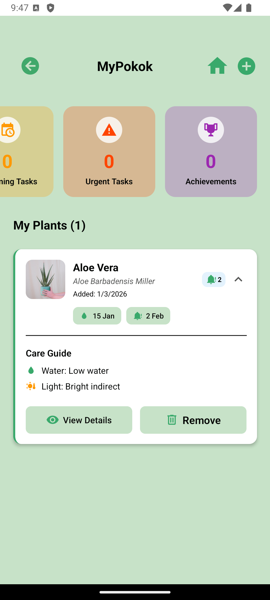
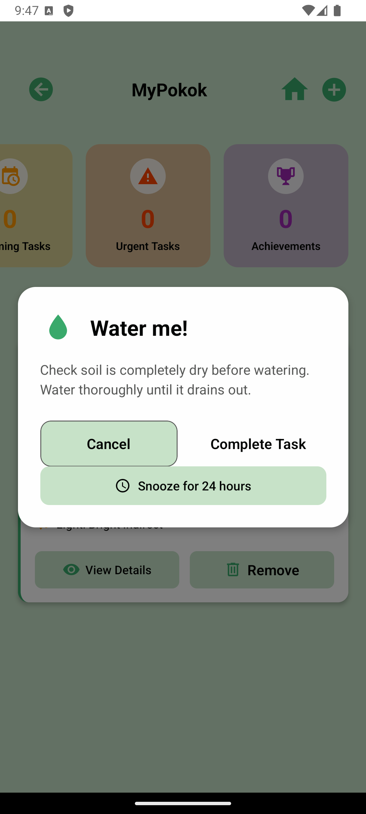
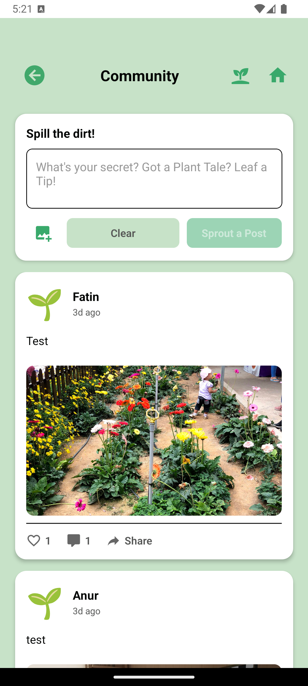
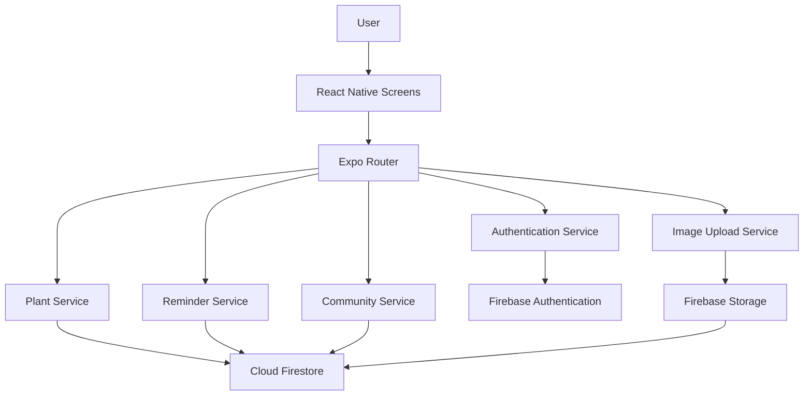

# 🌱 JagaPokok

## Overview

JagaPokok is a cross-platform indoor plant care application built with React Native, Expo, Firebase Authentication, Cloud Firestore, and Firebase Storage.

The application helps users manage indoor plants through personalized plant tracking, intelligent care reminders, and growth monitoring. It combines practical plant care information with a simple and intuitive mobile experience for both beginners and plant enthusiasts.

## Why I Built JagaPokok

I enjoy gardening and caring for indoor plants, but I often found myself forgetting when I last watered or fertilized them. As my collection grew, it became difficult to keep track of each plant's care schedule and monitor their growth over time.

JagaPokok was created to solve that problem. My goal was to build a simple and practical mobile application that helps plant owners organize plant care, receive timely reminders, and document each plant's growth journey in one place.

## Features

- 🌱 Indoor plant database with care information
- 📚 Scientific and common plant names
- 🌿 Basic care guides for each plant
- 💚 Plant benefits and companion suggestions
- 👤 Personal plant collection
- ⏰ Automatic care reminders based on plant requirements
- ⚙️ Custom reminder scheduling
- 📷 Photo gallery to document plant growth over time
- 📈 Track plant growth over time
- 🌍 Community platform for sharing plant care experiences
- ❤️ Like, comment, and interact with other users
- 🔍 Plant identification using the camera (Work in Progress)
- 🧪 Unit and integration test structure using Jest

## Screenshots

The screenshots below show the main JagaPokok user journey, including plant discovery, plant care information, personal plant management, reminders, and community interaction.

<table>
  <tr>
    <th>Home</th>
    <th>Plant Details</th>
    <th>My Plants</th>
  </tr>
  <tr>
    <td align="center">
      
    </td>
    <td align="center">
      
    </td>
    <td align="center">
      
    </td>
  </tr>
  <tr>
    <tr>
  <th>Care Reminders</th>
  <th colspan="2">Community</th>
</tr>
<tr>
  <td align="center">
    
  </td>
  <td colspan="2" align="center">
    
  </td>
</tr>

</table>

## 🛠 Tech Stack

| Technology              | Purpose                           |
| ----------------------- | --------------------------------- |
| React Native            | Cross-platform mobile development |
| Expo                    | Development framework             |
| Firebase Authentication | User authentication               |
| Cloud Firestore         | Database                          |
| Firebase Storage        | Store uploaded plant images       |
| JavaScript              | Application development           |
| Expo Router             | Navigation                        |

## 🏗 Application Architecture

JagaPokok uses a modular architecture that separates the user interface, application logic, and Firebase services.



### Architecture Overview

- React Native screens provide the mobile user interface.
- Expo Router manages navigation between screens.
- Service modules handle authentication, plants, reminders, community features, and image uploads.
- Firebase Authentication manages user accounts and login sessions.
- Cloud Firestore stores plant, reminder, growth, and community data.
- Firebase Storage stores uploaded plant and community images.

## 📁 Folder Structure

```text
JagaPokok/
├── __tests__/             # Unit and integration tests
├── app/                   # Expo Router routes and application pages
├── assets/
│   ├── images/            # Application images and visual assets
│   └── screenshots/       # Screenshots used in this README
├── components/            # Reusable user interface components
├── constants/             # Shared constants and configuration values
├── hooks/                 # Custom React hooks
├── screens/               # Main application screens
├── scripts/               # Project utility scripts
├── services/              # Firebase and application service modules
├── App.tsx                # Application entry file
├── app.json               # Expo application configuration
├── jest.config.js         # Jest test configuration
├── package.json           # Dependencies and project scripts
└── README.md              # Project documentation
```

The project separates interface components, application screens, reusable hooks, and service modules. This structure keeps Firebase operations and application logic separate from the user interface.

## ⚙️ Installation

### Prerequisites

Before running the project, install:

- Node.js
- npm
- Expo Go on a mobile device, or an Android or iOS emulator

### Setup

1. Clone the repository.

```bash
git clone https://github.com/AnurAfitahMI/JagaPokok.git
```

2. Open the project folder.

```bash
cd JagaPokok
```

3. Install the project dependencies.

```bash
npm install
```

4. Start the Expo development server.

```bash
npx expo start
```

5. Run the application using one of these options:

- Scan the QR code using Expo Go
- Press `a` to open the Android emulator
- Press `i` to open the iOS simulator

A Firebase project and valid Firebase configuration are required for authentication, database, and image-storage features.

## 💡 Lessons Learned

Building JagaPokok independently gave me experience across the full mobile application development process, from planning and database design to implementation, testing, debugging, and documentation.

Through this project, I learned how to:

- Structure a React Native application using reusable components, screens, hooks, and service modules
- Design and manage data using Cloud Firestore
- Implement user authentication and image uploads with Firebase
- Build automatic and customizable plant care reminders
- Separate Firebase operations from user interface logic
- Test application functions using Jest
- Debug integration issues across navigation, storage, and cloud services
- Manage a software project within a 12-week development timeline

The project strengthened my problem-solving skills and taught me to break complex features into smaller, manageable tasks. It also reinforced the importance of clean project structure, consistent naming, testing, and technical documentation.

## 🚀 Future Improvements

Planned improvements for JagaPokok include:

- Complete the plant identification feature
- Improve reminder reliability and notification handling
- Add search and filtering for the plant database
- Expand the plant information database
- Add editing and deletion controls for community posts
- Improve image compression and upload performance
- Add stronger form validation and error messages
- Increase automated test coverage
- Improve accessibility and responsive layout
- Prepare the application for production deployment

## 👤 Author

Anur Afitah Mohd Isa

Diploma in Information Technology graduate from the University of Malaya with a CGPA of 3.97/4.00. I am building my career in IT, digital project delivery, and project coordination.

- GitHub: [AnurAfitahMI](https://github.com/AnurAfitahMI)
- LinkedIn: [linkedin.com/in/aam1](https://www.linkedin.com/in/aam1)
