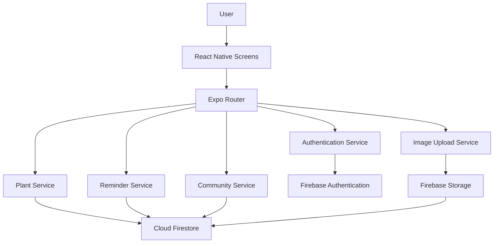

# 🌱 JagaPokok

## Overview

JagaPokok is a cross-platform indoor plant care application built with React Native, Expo, Firebase Authentication, Cloud Firestore, and Firebase Storage.

The application helps users manage indoor plants through personalized plant tracking, intelligent care reminders, and growth monitoring. It combines practical plant care information with a simple and intuitive mobile experience for both beginners and plant enthusiasts.

## Why I Built JagaPokok

I enjoy gardening and caring for indoor plants, but I often found myself forgetting when I last watered or fertilized them. As my collection grew, it became difficult to keep track of each plant's care schedule and monitor their growth over time.

JagaPokok was created to solve that problem. My goal was to build a simple and practical mobile application that helps plant owners organize plant care, receive timely reminders, and document each plant's growth journey in one place.

## Features

- 🌱 Indoor plant database with care information
- 📚 Scientific and common plant names
- 🌿 Basic care guides for each plant
- 💚 Plant benefits and companion suggestions
- 👤 Personal plant collection
- ⏰ Automatic care reminders based on plant requirements
- ⚙️ Custom reminder scheduling
- 🕒 Intelligent reminder scheduling based on each plant's care requirements.
- 📷 Photo gallery to document plant growth over time
- 📈 Track plant growth over time
- 🌍 Community platform for sharing plant care experiences
- ❤️ Like, comment, and interact with other users
- 🔍 Plant identification using the camera (Work in Progress)
- 🧪 Unit and integration test structure using Jest

## Screenshots

The screenshots below show the main JagaPokok user journey, including plant discovery, plant care information, personal plant management, reminders, and community interaction.

| Home                                                         | Plant Details                                                           | My Plants                                                                |
| ------------------------------------------------------------ | ----------------------------------------------------------------------- | ------------------------------------------------------------------------ |
|  |  |  |

| Care Reminders                                                       | Community                                                              |
| -------------------------------------------------------------------- | ---------------------------------------------------------------------- |
|  |  |

## 🛠 Tech Stack

| Technology              | Purpose                           |
| ----------------------- | --------------------------------- |
| React Native            | Cross-platform mobile development |
| Expo                    | Development framework             |
| Firebase Authentication | User authentication               |
| Cloud Firestore         | Database                          |
| Firebase Storage        | Store uploaded plant images       |
| JavaScript              | Application development           |
| Expo Router             | Navigation                        |

## 🏗 Application Architecture

JagaPokok uses a modular architecture that separates the user interface, application logic, and Firebase services.



### Architecture Overview

- React Native screens provide the mobile user interface.
- Expo Router manages navigation between screens.
- Service modules handle authentication, plants, reminders, community features, and image uploads.
- Firebase Authentication manages user accounts and login sessions.
- Cloud Firestore stores plant, reminder, growth, and community data.
- Firebase Storage stores uploaded plant and community images.

## 📁 Folder Structure

```text
JagaPokok/
├── __tests__/             # Unit and integration tests
├── app/                   # Expo Router routes and application pages
├── assets/
│   ├── images/            # Application images and visual assets
│   └── screenshots/       # Screenshots used in this README
├── components/            # Reusable user interface components
├── constants/             # Shared constants and configuration values
├── hooks/                 # Custom React hooks
├── screens/               # Main application screens
├── scripts/               # Project utility scripts
├── services/              # Firebase and application service modules
├── App.tsx                # Application entry file
├── app.json               # Expo application configuration
├── jest.config.js         # Jest test configuration
├── package.json           # Dependencies and project scripts
└── README.md              # Project documentation
```

The project separates interface components, application screens, reusable hooks, and service modules. This structure keeps Firebase operations and application logic separate from the user interface.

## 📂 Project Structure

```text
app/                Application screens and navigation
components/         Reusable UI components
services/           Firebase and business logic
screens/            Feature-specific screens
assets/             Images and application resources
hooks/              Custom React hooks
constants/          Theme and configuration
__tests__/          Unit and integration tests
```

## 🚀 Installation

Clone the repository.

```bash
git clone https://github.com/AnurAfitahMI/JagaPokok.git
```

Install dependencies.

```bash
npm install
```

Start the Expo development server.

```bash
npx expo start
```

## Lessons Learned

JagaPokok was my first complete mobile application developed independently. From planning and database design to implementation, testing, and debugging, every stage of the project challenged me to learn new technologies and solve real-world problems.

There were moments when I wanted to give up, especially while working late nights to meet my final year project deadline. Completing the project taught me persistence, problem-solving, and the importance of breaking complex problems into manageable tasks. I learned how to organize application logic into reusable services, making the project easier to maintain and expand.

Looking back, I am proud that I transformed an idea inspired by my own gardening hobby into a fully functional mobile application.

## Future Improvements

- 🌿 AI-powered plant identification
- ☁️ Cloud synchronization across multiple devices
- 🤝 Enhanced community interaction
- 🌦️ Weather-aware watering recommendations
- 📊 Advanced plant growth analytics

## 👨‍💻 Author

**Anur Afitah Mohd Isa**

Diploma in Information Technology

University of Malaya

LinkedIn:
https://linkedin.com/in/aam1
